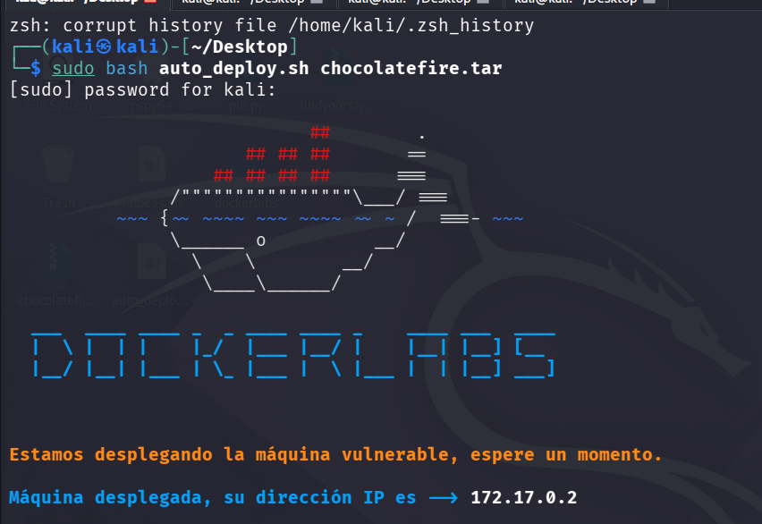
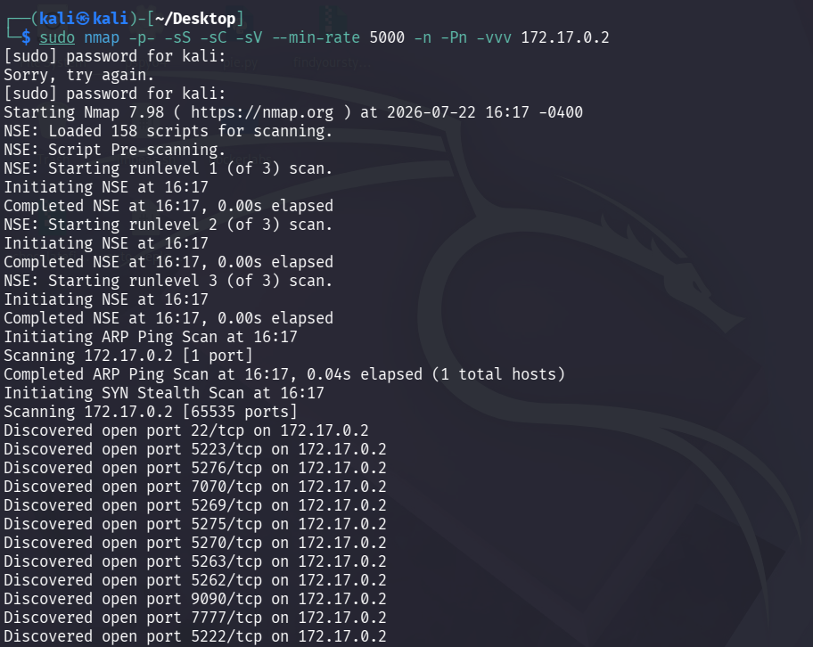
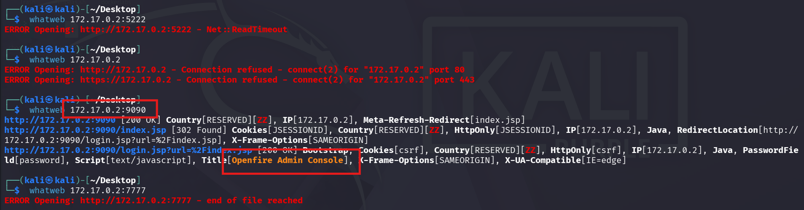
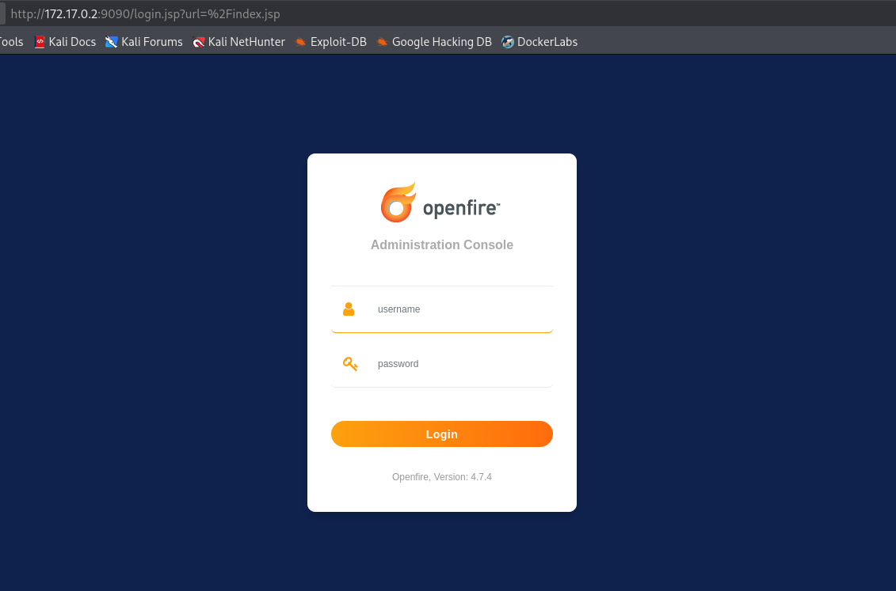
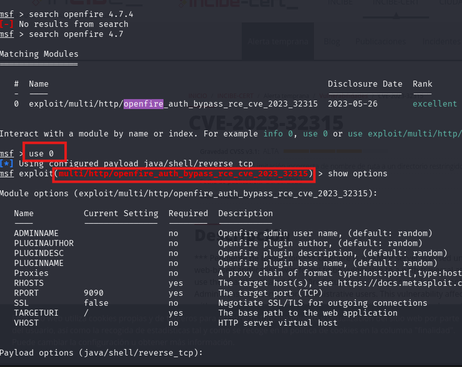
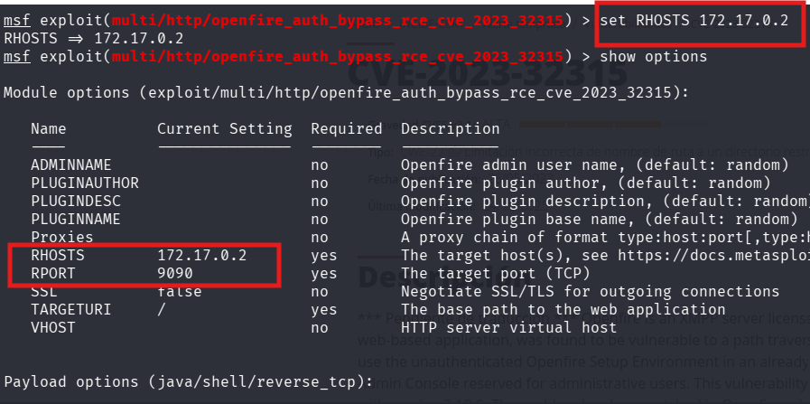
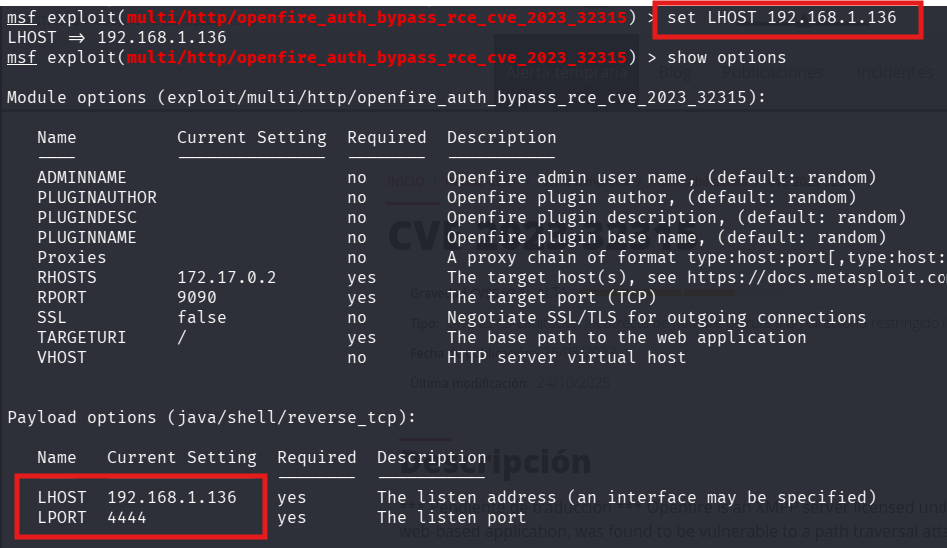
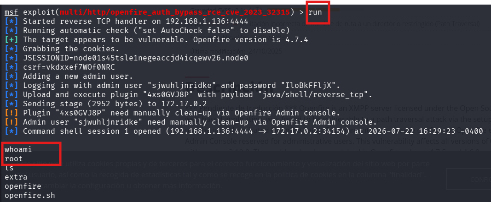

# ChocolateFire

- **Plataforma:** DockerLabs 
- **Dificultad:** 🟡 Medium 
- **Sistema Operativo:** Linux 
- **Fecha de resolución:** 22/07/2026 
- **Autor del writeup:** Raquel Romero

---


# 📖 Descripción

ChocolateFire es una máquina Linux de dificultad media de DockerLabs cuyo objetivo es comprometer un servicio Openfire vulnerable para obtener acceso al sistema.
Durante la resolución se emplean técnicas básicas de reconocimiento, enumeración de servicios, identificación de versiones vulnerables y explotación mediante Metasploit, finalizando con la obtención de privilegios de administrador.

---

# 🎯 Objetivos

- Enumerar los servicios expuestos.
    
- Identificar posibles vulnerabilidades.
    
- Obtener acceso inicial.
    
- Escalar privilegios.
    
- Obtener acceso como root/Administrator.
    


---

# 1️⃣ Reconocimiento

## Despliegue de la maquina


---

# 2️⃣ Enumeración

## Escaneo con Nmap

### Comando

```bash
sudo nmap -p- -sS -sC -sV --min-rate 5000 -n -Pn -vvv 172.17.0.2
```

### Resultado




---

# 3️⃣ Identificación de servicios web 


Tras observar un número elevado de puertos abiertos, el siguiente paso fue identificar qué servicios estaban ejecutándose en cada uno de ellos. Para ello utilicé **WhatWeb**, una herramienta que permite detectar tecnologías y aplicaciones web, con el objetivo de localizar aquellos servicios que pudieran ser de interés para continuar la investigación.




El análisis con WhatWeb mostró que la mayoría de los puertos abiertos no exponían un servicio web accesible. Sin embargo, el **puerto 9090** devolvió información relevante, identificando una aplicación desarrollada en **Java** con un panel de autenticación accesible mediante `login.jsp`. Además, el título de la página indicaba que se trataba de una **Openfire Admin Console**, convirtiéndose en el principal objetivo para continuar con la fase de enumeración

---

## 4️⃣Enumeración de OpenFire




Las versiones **4.7.0 hasta 4.7.4** son vulnerables a **CVE-2023-32315**, una vulnerabilidad que permite eludir la autenticación de la consola de administración mediante un fallo en el entorno de configuración

---

#  5️⃣ Explotación mediante Metasploit

Se realizó una búsqueda dentro de Metasploit para localizar un módulo compatible con la versión identificada de Openfire.


En este caso, se indicó la dirección IP de la máquina objetivo mediante el parámetro **RHOSTS** y se verificó la configuración disponible utilizando el comando `show options`.



Además de configurar el objetivo, fue necesario indicar al módulo la dirección IP de la máquina atacante. Para ello se estableció el parámetro **LHOST**, que corresponde al equipo donde se recibirá la conexión inversa una vez que la explotación se complete correctamente.



# 6️⃣Ejecución del exploit

Una vez configurados todos los parámetros del módulo y del payload, se ejecutó el exploit mediante el comando `run`. Durante el proceso, Metasploit comprobó automáticamente que la versión de Openfire era vulnerable y llevó a cabo la explotación del servicio.


## Verificación del acceso

Una vez obtenida la sesión, se ejecutó el comando `whoami` para comprobar el nivel de privilegios con el que se había accedido al sistema.

## 7️⃣ Resumen del ataque

| Fase                        | Resultado                                                                |
| --------------------------- | ------------------------------------------------------------------------ |
| Reconocimiento              | Identificación de la IP de la máquina                                    |
| Enumeración                 | Descubrimiento de múltiples puertos abiertos                             |
| Identificación de servicios | Detección de Openfire en el puerto 9090                                  |
| Investigación               | Identificación de la versión 4.7.4 y de la vulnerabilidad CVE-2023-32315 |
| Explotación                 | Uso del módulo de Metasploit para obtener una shell                      |
| Resultado                   | Acceso como **root**                                                     |

---


```
# Lecciones aprendidas

- No todos los puertos abiertos son interesantes.
- Identificar versiones exactas puede ahorrar mucho tiempo.
- WhatWeb resulta muy útil para identificar tecnologías web.
- Antes de utilizar un exploit es importante confirmar que la versión es vulnerable.
- Metasploit automatiza la explotación, pero es fundamental comprender el funcionamiento del módulo utilizado.
```


Herramientas Utilizadas.

|Herramienta|Función|
|---|---|
|Nmap|Enumeración|
|WhatWeb|Identificación de tecnologías|
|Firefox|Acceso a la consola|
|Google|Investigación|
|Metasploit|Explotación|

